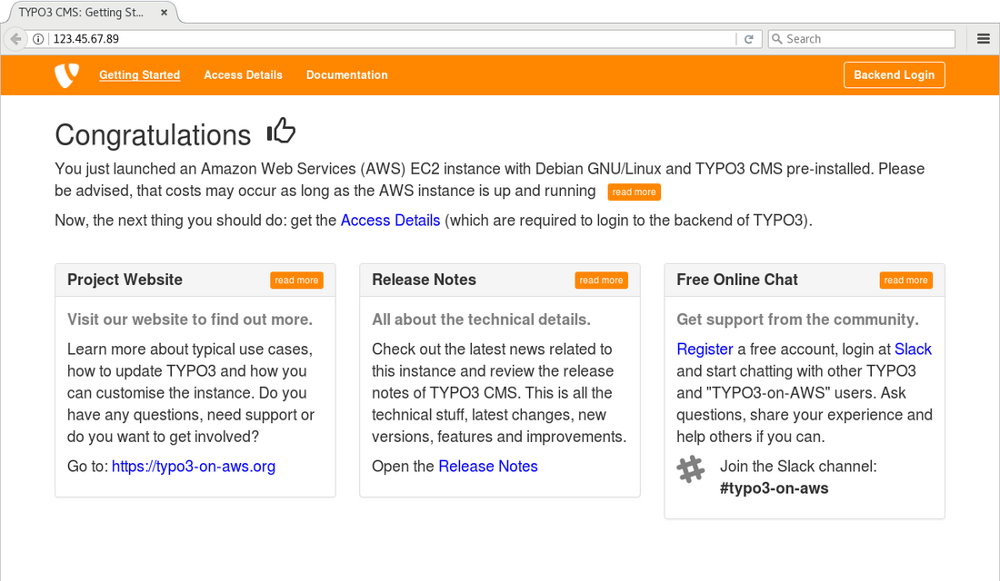
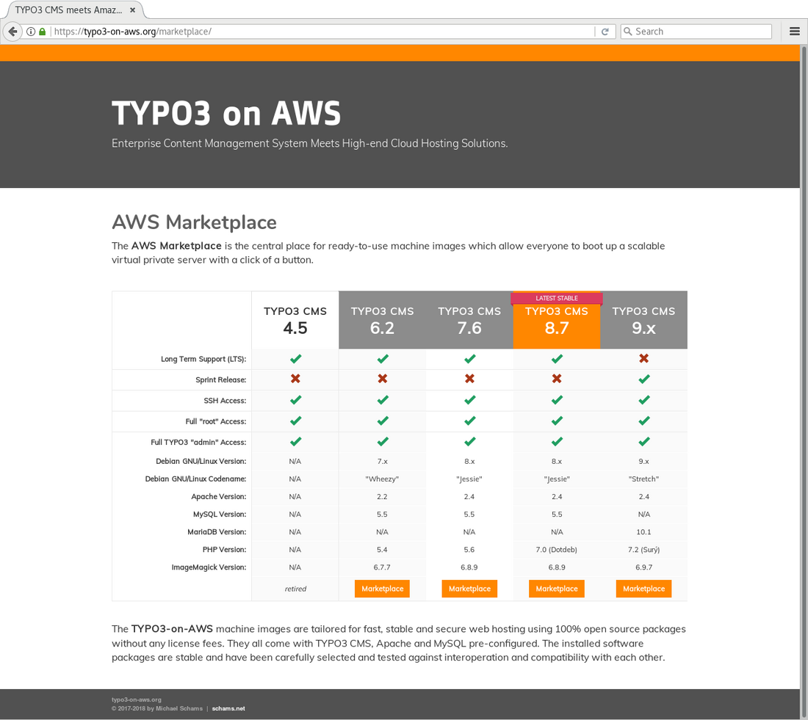

<!-- First published on typo3.com -->

> #### Possibly Outdated Information {.info .info-headline .info-icon}
>
> This article was published in March 2018 at [typo3.com](https://typo3.com/blog/typo3-on-amazon-web-services-part-2).
> While the majority of the contents is still valid, please be adviced that some details are possibly slightly outdated today.

### Introduction

With the release of the first TYPO3 v9 sprint release last year, a new era has started. This also applies to the **TYPO3-on-AWS** initiative, which aims to make TYPO3 CMS easily available at the cloud service provider Amazon Web Services (AWS).

AWS provides on-demand cloud computing platforms and services at 16 geographical regions throughout the world. We are very happy to announce that TYPO3 v9 completes the existing portfolio of TYPO3 instances and TYPO3 version 9.1 is now also available as a ready-to-use machine image at the [AWS Marketplace](https://aws.amazon.com/marketplace/search/results?searchTerms=schams.net).

Michael Schams (schams.net) has created and maintained TYPO3 machine images for AWS since 2013. These are ready-to-use Debian GNU/Linux-based servers, tailored for fast, stable and secure web hosting using 100% open source packages without any license fees. The new TYPO3 v9 instances come with TYPO3, Apache, MariaDB and PHP 7.2 pre-configured. The installed software packages are stable and have been carefully selected and tested for interoperation and compatibility with each other.

Visit [https://typo3-on-aws.org/marketplace/](https://typo3-on-aws.org/marketplace/) and simply follow the step-by-step instructions. Choose the TYPO3 major version you would like to launch (e.g. TYPO3 v7, v8 or v9) and follow the instructions to subscribe to the service. Once the server is running, you can access the TYPO3 instance using your browser and login to the server via SSH.

{.img-screenshot .img-fluid .mx-auto .d-block}

A virtual server is called “EC2 instance” in the AWS universe: Amazon Elastic Compute Cloud. EC2 instances can be scaled up and down at any time and they can be started and stopped. The costs depend on the instance type you choose (CPU, memory, disk space, etc.) and you only pay for a running server, starting at US $0.0058 per hour for the smallest instance type.

### You are in Full Control

The default server setup has been left minimalistic intentionally and only absolutely required components are installed. However, this does not mean that you have to cope with a simple, basic system. Unlike some other hosting companies or cloud-based solutions, the TYPO3-on-AWS instances do not have any access restrictions: neither in TYPO3, nor on a server level.

#### Full Administrator Access to TYPO3

The default backend user has administrator privileges and can be used to create other users (administrators, editors, etc.) or to configure the TYPO3 instance. You can install and remove extensions, have access to the Install Tool and full control over the setup. In short: no limits at all.

#### Full “root” Access to the Server

Once you are logged-in as the “admin” user via SSH, “sudo” allows you to run commands with superuser privileges. This means, you have full access to all aspects of the server and you can customize the system to your specific needs.

If you prefer the “nginx” web server over “Apache” for example (Apache is installed and configured by default), simply replace the software packages. In case additional software or services are required, they can be installed. You can also change the default configuration and fine-tune the system to your heart’s content.

### Pay as you Go

Despite the fact that running an EC2 instance at AWS does not cost you a fortune, you possibly want to save every cent. Luckily, almost all services at AWS are “pay-as-you-go”, which means, you only pay if and when you are using them.

You can simply “stop” your running EC2 instance via the Management Console, which shuts down the running server. AWS does not charge for stopped EC2 instances and you can boot them up again, whenever you want.

If you do not need the server anymore, “terminate” the EC2 instance, which destroys all data and disk partitions (“volumes”) if not explicitly configured otherwise.

### Typical Use Cases

Having a first glance at one of the TYPO3 v9 sprint releases is only one option that you can do with the TYPO3-on-AWS machine images. Due to the fact that Michael has taken care of all major TYPO3 versions over the last 5 years, you will find a wide range of TYPO3 versions: TYPO3 version 6.2 LTS, 7.6 LTS, 8.7 LTS and the sprint releases of TYPO3 v9 (even TYPO3 version 4.5 was available, but has been retired for good reason).

Typical use cases for TYPO3-on-AWS are for example:

- find out, how powerful TYPO3 is (in particular if you are new to TYPO3)
- check out and test new releases, before using them in production
- test your own extensions in a specific release
- install, test and review a specific TYPO3 extension to evaluate its function
- use the instance as a development/test/approval platform
- use the server as a foundation for your own set up
- check or review security-related issues
- demonstrate the power of TYPO3 to your clients
- use the instance during seminars, workshops, lectures; let your clients or students play with it

In addition to the options listed above, the instances are also perfectly suitable for production workloads of course. However, keep in mind that you are responsible for the system, which includes keeping TYPO3 as well as the operating system up-to-date (e.g. deploying security patches when they become available).

### Leverage Cloud Services

As soon as you are familiar with some of the AWS services, you should consider taking advantage of the vast benefits of the cloud solutions offered by AWS. As of today, AWS is the market leader in cloud services and this would not be the case, if they would just offer virtual machines as described above.

Some of the services, which make a TYPO3 site highly available, scalable and secure, are for example Amazon RDS Aurora (a relational database service based on MariaDB), Amazon CloudFront (a content delivery network with more than 100 nodes across 24 countries), Amazon Certificate Manager (a service to get a free SSL/TLS certificate), Amazon S3 (an object storage, perfectly suitable to store backups or static resources) and many more.

### Getting Started

If you are interested to explore the options, e.g. check out the latest TYPO3 v9 release, jump online and go to [typo3-on-aws.org](https://typo3-on-aws.org). This is the perfect starting point to launch a TYPO3 instance on AWS.

{.img-screenshot .img-fluid .mx-auto .d-block}

<!--
If you have any questions or if you want to share your experience, join the Slack channel #typo3-on-aws on [typo3.slack.com <i class="fas fa-external-link-alt external-link-icon"></i>](https://typo3.slack.com/).
-->

This article is the first part of a two-parts series. The [second part](typo3-on-amazon-web-services-part-2.md) describes how to launch a TYPO3-on-AWS instance in more detail and provides further insight into how AWS services can enhance a TYPO3 site.
