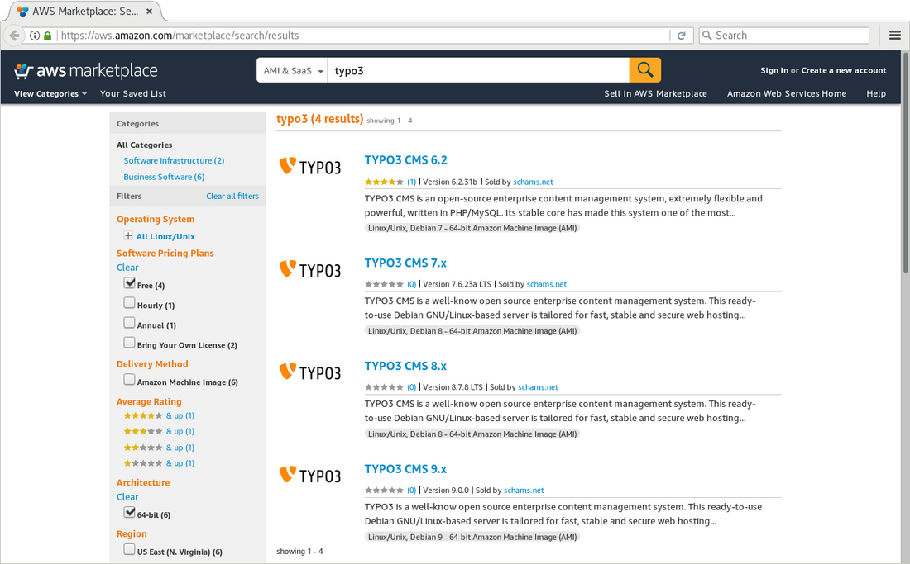
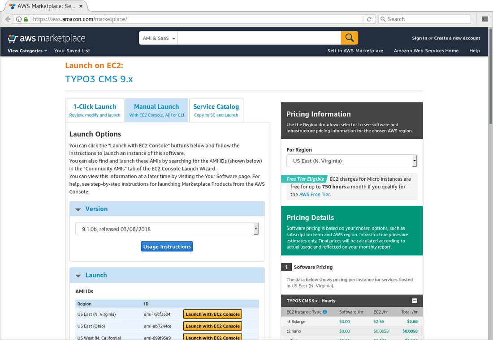
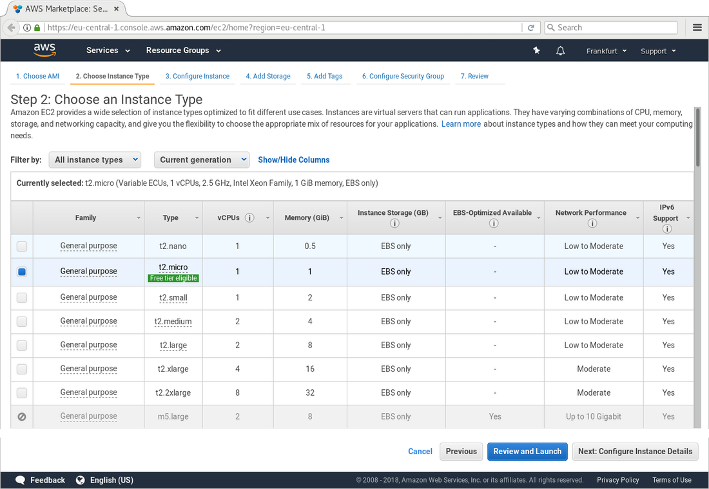
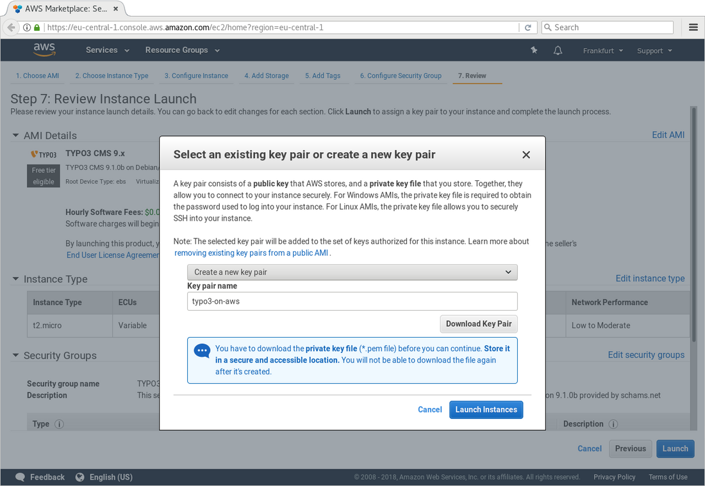
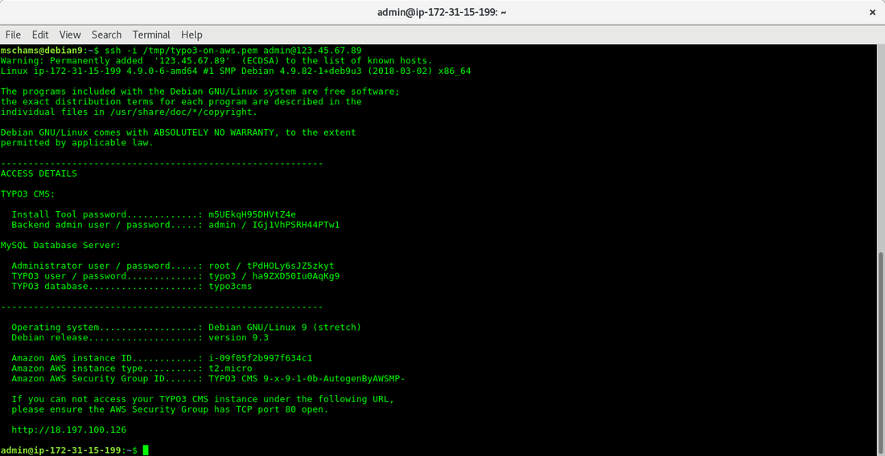

<!-- First published on typo3.com -->

> #### Possibly Outdated Information {.info .info-headline .info-icon}
>
> This article was published in March 2018 at [typo3.com](https://typo3.com/blog/typo3-on-amazon-web-services-part-2).
> While the majority of the contents is still valid, please be adviced that some details are possibly slightly outdated today.

### Introduction

In our [previous article](typo3-on-amazon-web-services-part-1.md) about TYPO3 on Amazon Web Services (AWS), we described the machine images available at the [AWS Marketplace](https://typo3-on-aws.org/marketplace/) and the benefits of using a pre-configured system with TYPO3 installed and ready to go.

The second part of the series focuses a little bit more on the technical aspects and explains how to launch the latest TYPO3 v9 sprint release and provides details about further cloud services offered by AWS and worth to consider.

Read on, if you want to know how to spin up a modern Linux server *in the cloud* with TYPO3 pre-installed and ready to use in less than 5 minutes. No setup fees incur and you only pay when you are actually using the instance, billed by the second, starting at US $0.0058 per hour.

### AWS Marketplace

Once you have created an account and logged-in at the Amazon Management Console, more than 90 services including computing, storage, networking, database, deployment, etc. are at your disposal. You can either set up your own virtual server from scratch or choose a so-called “machine image”, which is available at [typo3-on-aws.org](https://typo3-on-aws.org/).

{.img-screenshot .img-fluid .mx-auto .d-block}

First of all, make sure you are logged-in at the Management Console. Go to [https://typo3-on-aws.org/marketplace/](https://typo3-on-aws.org/marketplace/) and choose the TYPO3 major version you would like to launch, e.g. TYPO3 v9. On the Marketplace page, continue to subscribe (button at the top right of the page). Now you have two main options: “Launch with 1-Click” or “Manual Launch”. The first option is ideal if you are already familiar with the service and you already created an SSH key pair, etc. However, let’s assume you have not used AWS before.

{.img-screenshot .img-fluid .mx-auto .d-block}

Switch to tab “Manual Launch”, select the TYPO3 version you would like to use (e.g. “TYPO3 Version 9.1.0”) and click one of the “Launch with EC2 Console” buttons right of the region your server should be located, for example “EU (Frankfurt)”. This opens the Amazon Management Console, where you can choose the instance type in the next step.

{.img-screenshot .img-fluid .mx-auto .d-block}

The instance type determines size and performance of your server (e.g. number of vCPUs, memory, etc.). Under certain circumstances you might be eligible for the [free tier](https://aws.amazon.com/free/), which allows you to run a t2.micro instance for free for the first 12 months following your AWS sign-up date (up to 750 hours each month). The micro instance is a good choice if you want to quickly boot up an instance and test something. If you need more power, choose an instance type with higher specs. Keep in mind: you can always scale up and down your instance if and when required.

If you click the “Review and Launch” button now, you skip all the fine-tuning options, which is probably ok in most cases. You can review all settings on the following page, before you click the “Launch” button. Alternatively, go through the configuration pages by using “next” and “previous”, and increase the disk space, add further partitions, adjust the security group (firewall rules), etc. as required.

Before the instance spins up, you have to create a new or select an existing key pair. The public key will be installed on the server and allows you to access the server via SSH, using the private key. In case you create a new key pair, give it a name and do not forget to download the private key. It won’t be stored at AWS and without the private key, you can not login at the instance.

{.img-screenshot .img-fluid .mx-auto .d-block}

Once the server is running, follow the link to view the instance. The description shows the URL (or IP address) of the server. Wait a few minutes for the server to boot up completely. Then enter the IP address in your browser. The welcome screen that comes up is already part of your TYPO3 instance.

To retrieve the access details to the backend of TYPO3, you need to login to the server via SSH using “admin” as the user name and the private key your created during the launch process.

{.img-screenshot .img-fluid .mx-auto .d-block}

### You are in Full Control

As outlined in the previous article, you have administrator access to the TYPO3 backend and full access to the underlying server (“superuser privileges”). This allows you to customize the TYPO3 instance to your heart’s content and re-configure the server, including removing, installing, replacing software packages, etc.

#### Classic vs. Composer Setup

You don’t need to be a developer, PHP guru or Linux expert to launch and run a TYPO3-on-AWS instance. The machine image is pre-installed and pre-configured with all components required, which makes it easy - even for beginners - to get a TYPO3 instance started in no time. Third party extensions can easily be installed via the Extension Manager in the backend.

However, depending on your level of expertise or concrete use case, you possibly prefer a TYPO3 instance installed by using [PHP composer](https://getcomposer.org/). Nothing easier than that: boot up the EC2 instance, login via SSH and chuck away the existing TYPO3 installation and database. Then re-install TYPO3 using composer (see [instructions](https://composer.typo3.org/)) and voila, that’s it.

### Leverage Cloud Services

AWS is the market leader in cloud services as of today and offers a wide range of products and solutions, which make a TYPO3 site highly available, scalable and blazing fast. The examples below are just a small selection of components and services worth to consider.

[EC2 instances](https://aws.amazon.com/ec2/) (the virtual server TYPO3 runs on) can be scaled up and down as required. If you expect more traffic, e.g. during a marketing campaign, double or quadruple the server specs. Once the traffic goes down, scale down the server again -- and only pay what you have used.

The database can be moved away from the server to Amazon RDS, a relational database service with a choice of six popular database engines, including MySQL, Aurora (MariaDB), PostgreSQL and Microsoft SQL Server. In a Multi-AZ setup, AWS takes care of replicating the data across multiple data centres, which are physically separated. Does your current hosting provider offer such a highly available database setup at a similar price range?

By using Amazon CloudFront, some or all pages, images, videos, etc. on your TYPO3 site can be cached in a global content delivery network (CDN) and delivered to your site visitors by the nearest server to their geographical location. This results in a significant performance boost and less load on the TYPO3 server, because only a portion of all requests hit the EC2 instance. Amazon CloudFront has more than 100 nodes across 24 countries, which ensures that all of your site visitors experience a low page load time, independent from where they are located in the world.

In combination with Amazon CloudFront, SSL/TLS certificates can be issued for your website via the Amazon Certificate Manager (ACM). Make the Internet more secure and protect the privacy of your visitors by switching to HTTPS. The best of it is: SSL/TLS certificates issued via ACM are not only free of charge, but also auto-renew on a yearly basis.

Many more interesting services and features are offered by AWS, which let you get the most of a modern cloud-based TYPO3 hosting.

### Getting Started

If you are interested to explore the options, e.g. check out the latest TYPO3 v9 release, jump online and go to typo3-on-aws.org. This is your perfect starting point to launch a TYPO3 instance on AWS.

If you have any questions or if you want to share your experience, join the Slack channel `#typo3-on-aws` on [typo3.slack.com](https://typo3.slack.com).
