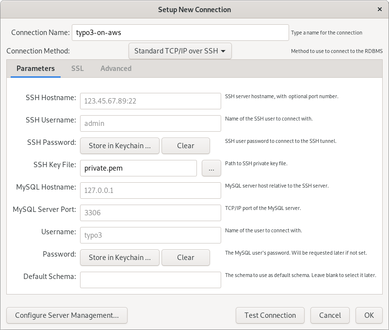

## Introduction

This article describes the steps on how to configure [MySQL Workbench](https://www.mysql.com/products/workbench/){.fa-icon .fa-right-external-link-alt} to access the database. Database clients installed on your local machine typically offer an easy-to-use graphical user interface (GUI) that makes it easy to manage the database and its contents.

We assume that you are using a TYPO3-on-AWS machine image with the MySQL/MariaDB database server running on the same machine. It is also possible to operate a decentralized database server on another EC2 instance or to use an AWS service such as [Amazon Aurora](set-up-typo3-and-amazon-aurora.md). Although the options of accessing these types of databases are similar to the ways described below, a detailed description is out of scope of this article.

## MySQL Workbench

You can use [MySQL Workbench](https://www.mysql.com/products/workbench/){.fa-icon .fa-right-external-link-alt} to access the database server that runs on the EC2 instance.

> "MySQL Workbench is a unified visual tool for database architects, developers, and DBAs.
> MySQL Workbench provides data modeling, SQL development, and comprehensive administration tools for server configuration, user administration, backup, and much more.
> MySQL Workbench is available on Windows, Linux and Mac OS X."
(MySQL Workbench website)

## Configuration

MySQL Workbench (and some other database clients) support a standard TCP/IP connection over SSH to connect to your DB server on the EC2 instance. This approach is called a *SSH tunneling*.

The following screenshot shows the configuration screen when setting up a new connection. Pay attention to the **connection method** and adjust the details according to your setup.

{.img-screenshottt .img-fluid .mx-auto .d-block .mb-5}

## Alternatives

- [Navicat](access-local-database-server-navicat.md)
