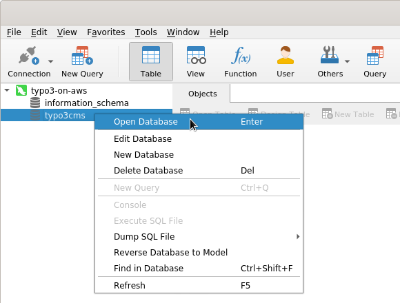

## Introduction

This article describes the steps on how to configure [Navicat](https://www.navicat.com){.fa-icon .fa-right-external-link-alt} to access the database. Database clients installed on your local machine typically offer an easy-to-use graphical user interface (GUI) that makes it easy to manage the database and its contents.

We assume that you are using a TYPO3-on-AWS machine image with the MySQL/MariaDB database server running on the same machine. It is also possible to operate a decentralized database server on another EC2 instance or to use an AWS service such as [Amazon Aurora](set-up-typo3-and-amazon-aurora.md). Although the options of accessing these types of databases are similar to the ways described below, a detailed description is out of scope of this article.

## Navicat

You can use [Navicat](https://www.navicat.com){.fa-icon .fa-right-external-link-alt} to access the database server that runs on the EC2 instance. Although, the following instructions are based on **Navicat Premium 15**, you can set up other software versions in the same or very similar way.

> "Navicat Premium is a database development tool that allows you to simultaneously connect to MySQL, MariaDB, MongoDB, SQL Server, Oracle, PostgreSQL, and SQLite databases from a single application. [...]. You can quickly and easily build, manage and maintain your databases."
(Navicat website)

## Configuration

Navicat (and some other database clients) support a standard TCP/IP connection over SSH to connect to your DB server on the EC2 instance. This approach is called a *SSH tunneling*.

Download Navicat from the [official website](https://www.navicat.com){.fa-icon .fa-right-external-link-alt} and install/run the software.

## Step 1

{.img-fluid .mx-auto .d-block .mb-5}

Create a new **MySQL** or **MariaDB** connection. Do not select the menu item *Amazon AWS*.

## Step 2

{.img-fluid .mx-auto .d-block .mb-5}

Provide the database access details in the tab *General* as shown in the screenshot above. Note that the host name reads `localhost`. The user name and password are shown when you log-in to the EC2 instance using SSH. Do not click "OK" at this point but continue with the next step.

## Step 3

{.img-fluid .mx-auto .d-block .mb-5}

Open the tab *SSH*, enable the checkbox "Use SSH tunnel", and enter the access details of the EC2 instance. Adjust the IP address accordingly. Choose *public key* as the authentication method and enter the path and file name of your **private** key file (e.g. `private.pem`). Do not enable compression.

You can now test the connection and/or save the configuration by clicking on the "OK" button.

## Step 4

{.img-fluid .mx-auto .d-block .mb-5}

The new connection is shown in the list. Double click the connection name or select *Open Connection* from the context menu.

## Step 5

{.img-fluid .mx-auto .d-block .mb-5}

Assuming, you did not configure a password to use your private key (this is the default), leave this field empty and click the "OK" button. This should establish a connection to the server through SSH which a green icon indicates.

## Step 6

{.img-fluid .mx-auto .d-block .mb-5}

Navicat lists all available databases. Double click the list entry "typo3cms" or select *Open Database* from the context menu.

## Step 7

{.img-fluid .mx-auto .d-block .mb-5}

You can now access, manipulate, manage, export the data and the tables of the TYPO3 database.

## Alternatives

- [MySQL Workbench](access-local-database-server-mysql-workbench.md).
