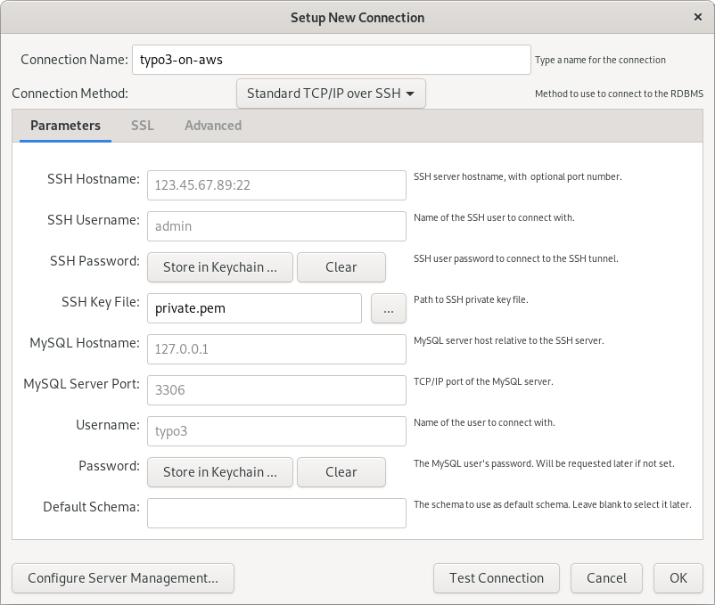

## Introduction

This article is based on the assumption that you are using a TYPO3-on-AWS machine image with TYPO3 version 10 LTS or newer installed (TYPO3 version 10.4.x).

System administrators sometimes need to access the database server directly. This documents provides some basic information about possible options to achive this.


## General Considerations

Administrators have several options to access the database. This article assumes that the database server is installed on the same EC2 instance as TYPO3. This setup is the default for TYPO3-on-AWS machine images.

It is also possible to operate a decentralized database server on another EC2 instance or to use a AWS service such as [Amazon Aurora](set-up-typo3-and-amazon-aurora.md). Although the options of accessing these types of databases are similar to the ways described below, a detailed description is out of scope of this article.

This article focuses on the following three most commonly used options:

- Through the "mysql" command line tool
- Using a TYPO3 extension
- Using a GUI tool such as MySQL Workbench

Please note that further options are available, but out of scope of this article.


## The "mysql" Command Line Tool

### Standard Access

Once you launched your TYPO3-on-AWS EC2 instance, you can access it using a SSH connection (see [access the server](../getting-started/access.md) for further details). Log in as user `admin` and note the access details that are displayed. Locate the **database access credentials** which consist of a user name and password. For example:

```text
...
MySQL/MariaDB user name..................: typo3
MySQL/MariaDB password...................: RRinmiB4KD1Y531G
MySQL/MariaDB database...................: typo3cms
...
```

The access credentials are randomly generated the first time the TYPO3-on-AWS system is launched. In the example above, the TYPO3 database user name is `typo3` and the password is `RRinmiB4KD1Y531G`. Also note the database name `typo3cms` as you need these three information in the next steps.

> ### Possibly Outdated Information {.info .info-headline .info-icon}
>
> Please note that you can change the database access details if required.
> If you do so, the credentials that are shown when you log in are possibly not longer up-to-date.

Enter the following command on the command line prompt to connect to the local database instance and the database named `typo3cms`:

```bash
$ mysql --user typo3 --password --database typo3cms
```

The system now asks for the password to be entered:

```text
Enter password:
```

The characters you enter are **not shown** while you type.

Once you are successfully logged in, you can execute database queries. Please find some typical examples below.

```sql
MariaDB [typo3cms]> SHOW TABLES;
```
```sql
MariaDB [typo3cms]> SELECT uid, username, email, disable, deleted FROM be_users;
```

Enter `quit` to exit the command line tool:

```sql
MariaDB [typo3cms]> quit
```


### Administrator Access

Some specific database maintenance tasks require **administrator privileges**. The creation of new database users is a typical example. To access the local database server with these higher privileges, enter the following command on the command line prompt:

```bash
$ sudo mysql
```


## TYPO3 Extensions

Another option to access the local database server directly is to use a web-based tool such as [phpMyAdmin](https://www.phpmyadmin.net/){.fa-icon .fa-right-external-link-alt} or [Adminer](https://www.adminer.org/){.fa-icon .fa-right-external-link-alt} for example. Both tools are also available as TYPO3 extensions.


> ### Not for Production {.warning .warning-headline .warning-icon}
>
> Please note that extensions that provide access to low-level functions often bypass TYPO3's security model.
> The official advice by TYPO3 security experts is **not to install** these kind of extensions on a production system.

The following two extensions are well known and sometimes used:

- "phpMyAdmin" (extension key: `phpmyadmin`), see [TYPO3 Extension Repository](https://extensions.typo3.org/extension/phpmyadmin){.fa-icon .fa-right-external-link-alt}.
- "Adminer" (extension key: `t3adminer`), see [TYPO3 Extension Repository](https://extensions.typo3.org/extension/t3adminer){.fa-icon .fa-right-external-link-alt}.

You can easily install the TYPO3 extension "phpMyAdmin" on a TYPO3-on-AWS instance using Composer (adjust the file system path appropriately as required):

```bash
$ cd /var/www/typo3v10/
$ composer require mehrwert/phpmyadmin
```

Please verify the compatibility with the TYPO3 version you are using. At the time of writing, the extension does not support TYPO3 version 11 for example.


## MySQL Workbench

The third option to access the database server directly is to use a MySQL/MariaDB client such as the [MySQL Workbench](https://www.mysql.com/products/workbench/){.fa-icon .fa-right-external-link-alt}.

> "MySQL Workbench is a unified visual tool for database architects, developers, and DBAs.
> MySQL Workbench provides data modeling, SQL development, and comprehensive administration tools for server configuration, user administration, backup, and much more.
> MySQL Workbench is available on Windows, Linux and Mac OS X."
<span style="margin-left: 0.5rem; color: #444444; font-size: 0.9rem; font-weight: bold; font-style: italic;">(MySQL Workbench website)</span>

In theory, you could [re-configure the Security Group](configure-security-group.md) and open the TCP port 3306 to allow access to the local database server. You would also need to update the MySQL/MariaDB server configuration to *listen* on the network interface (configuration option `bind-address`). However, this is an insecure and not recommended approach.

A better way is to *tunnel* the connection through SSH. MySQL Workbench (and some other database clients) support a standard TCP/IP connection over SSH to connect to your DB server on the EC2 instance.

The following screenshot shows the configuration screen when setting up a new connection. Note the **connection method** and adjust the details according to your setup.

{.img-screenshottt .img-fluid .mx-auto .d-block .mb-5}

Please note that MySQL Workbench is only one of many MySQL/MariaDB clients.
